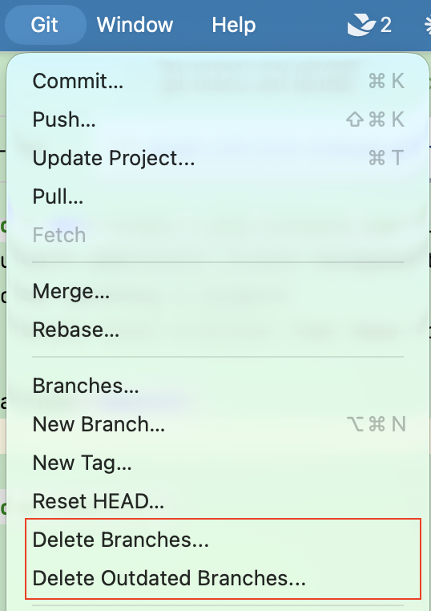
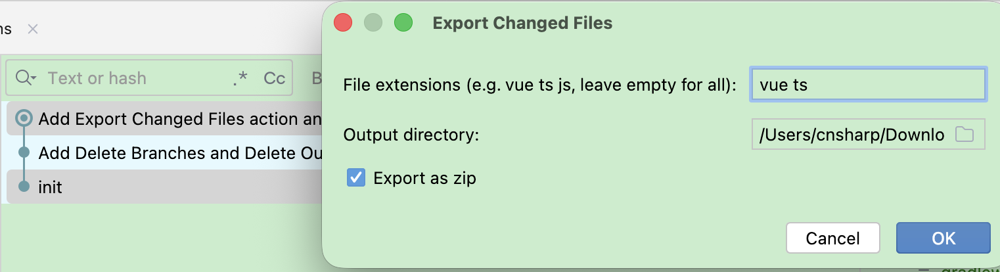

# Git Menu Ext

IntelliJ Platform plugin that adds extra Git actions for branch management and file export.

Compatible with all IntelliJ-based IDEs (IntelliJ IDEA, Rider, GoLand, WebStorm, etc.).



## Features

### Delete Branches

Deletes local branches matching a keyword.

**Location:** Git menu → Delete Branches...

1. Enter a keyword (e.g. `release-`)
2. Review the list of matched branches
3. Confirm to delete

The current branch is always skipped. All matched branches are force-deleted (`-D`).

---

### Delete Outdated Branches

Lists and deletes local branches that have no tracking remote, or whose remote is gone.

**Location:** Git menu → Delete Outdated Branches...

1. The plugin scans `git branch -vv` for branches with no remote or remote marked as `gone`
2. A checklist dialog shows the candidates (branches not fully merged are marked with ⚠)
3. Select branches to delete and confirm
   - Fully merged branches are deleted with `-d`
   - Unmerged branches are deleted with `-D`

---

### Export Changed Files

Exports all files changed between a range of commits in Git Log.

**Location:** Git Log context menu → Export Changed Files...

1. Select 2 commits in the Git Log (Ctrl/Cmd+click or drag to select a range)
2. Right-click → Export Changed Files...
3. Configure:
   - **File extensions**: filter by extension (e.g. `vue ts js`), leave empty for all files
   - **Output directory**: where to export
   - **Export as zip**: pack into a zip archive, or copy as a directory tree
4. The output is named `{project}-{oldestHash}-{newestHash}.zip` (or directory)




## Requirements

- IntelliJ Platform 2024.3+
- Git4Idea plugin (bundled with all JetBrains IDEs)

## Build

Requires JDK 17+.

```bash
JAVA_HOME=/path/to/jdk17 ./gradlew buildPlugin
```

Output: `build/distributions/git-menu-ext-*.zip`

## Install

**From disk:** Settings → Plugins → ⚙ → Install Plugin from Disk → select the zip file.

**From marketplace:**  [https://plugins.jetbrains.com/plugin/32206-git-menu-ext/](https://plugins.jetbrains.com/plugin/32206-git-menu-ext/)
